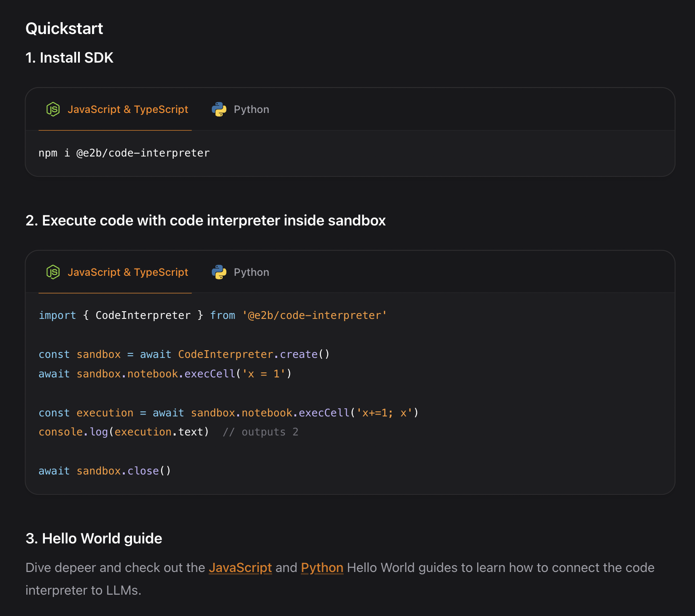

## Secure code execution with E2B

The open-source [Code Interpreter SDK](https://github.com/e2b-dev/code-interpreter) by [E2B](https://e2b.dev/docs) provides a secure sandboxed environment where you can run the output generated by Mistral's LLMs. 

To start building with E2B and Mistral, check out the examples in the [Mistral Cookbook](https://github.com/mistralai/cookbook). You can choose from a [Python](LINK_HERE) or [JavaScript/TypeScript](LINK_HERE) version.

### AI data analyst with Codestral and E2B - Python version

### AI data analyst with Codestral and E2B - JS/TS version

### What is E2B?

E2B provides an isolated sandbox environment for AI apps. It is the code interpreting layer where the LLM-generated code is executed. The SDKs by E2B have a Python and JavaScript/TypeScript version. E2B works with any LLM and all AI frameworks (e.g., LangChain, CrewAI, Autogen...)
To get familiar with E2B, check out the [E2B docs](https://e2b.dev/docs) or [E2B Cookbook](https://github.com/e2b-dev/e2b-cookbook). If you need support [hello@e2b.dev](mailto:hello@e2b.dev).

### Starting with Code Interpreter SDK
The Code Interpreter SDK is E2B's special SDK tailor-made for AI data analysts, coding apps, and reasoning-heavy agents. The SDK quickly creates a secure cloud sandbox powered by [Firecracker](https://github.com/firecracker-microvm/firecracker). Inside this sandbox is a running Jupyter server that the LLM can use.

To start, get your E2B API key [here](https://e2b.dev/docs/getting-started/api-key) for free. 

